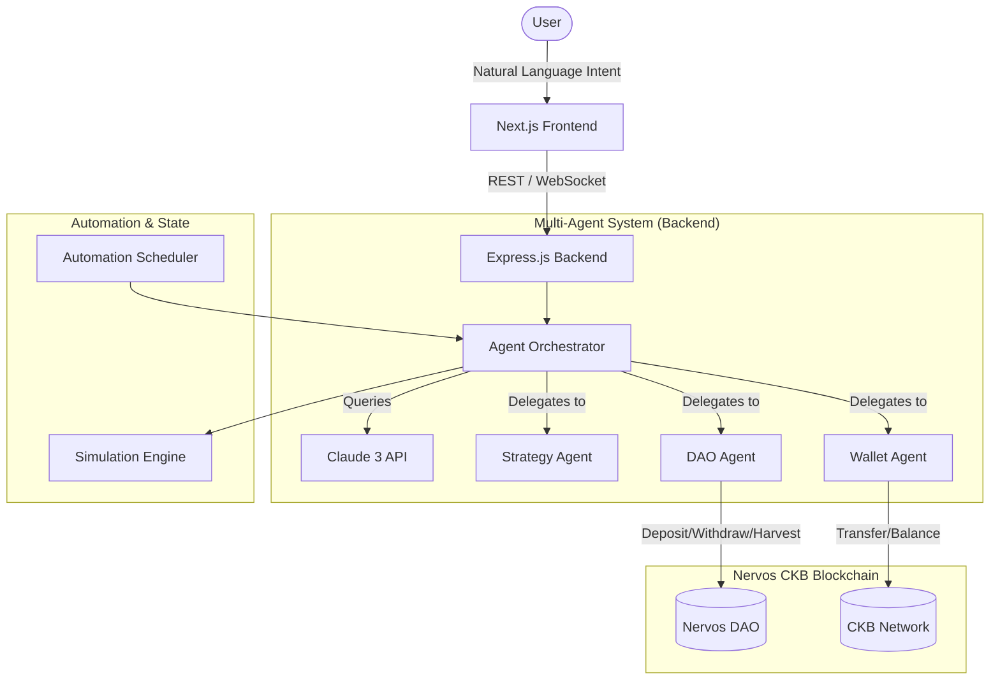

# System Architecture

## System Overview

The **CKB Autonomous Asset & DAO Yield Agent** is a cutting-edge, AI-driven automation framework built on the Nervos CKB Testnet. It empowers users to maximize their yield generation and manage blockchain assets simply by declaring natural language intents. 

At its core, the system utilizes a **Multi-Agent Architecture** powered by Anthropic's Claude API. When a user requests an action, the system delegates the workflow to specialized agents—a Strategy Intelligence Engine, a DAO Manager, and a Wallet Agent—each responsible for specific subsets of the transaction lifecycle.

## Architecture Diagram

## Data Flow

1. **Input Stage:** The user submits a prompt via the Next.js Frontend.
2. **Transportation:** The prompt is sent to the backend over REST, while a WebSocket connection is established to listen for real-time updates.
3. **Reasoning & Planning:** The backend routes the prompt to the Claude API. Claude outputs a structured JSON plan with specific tool calls.
4. **Execution Stage:** The Node.js orchestrator parses the tool calls and triggers blockchain scripts or simulator states.
5. **Feedback Loop:** As the agent executes functions (e.g., checking balance, projecting yield), the reasoning and results are pushed back to the frontend in real-time via WebSockets.

## Agent Flow

The system simulates a collaborative multi-agent environment to decompose complex tasks:
*   **Strategy Agent:** Analyzes the market, projects APY (Yield), and determines the best times for harvesting or locking assets.
*   **DAO Agent:** Intimately knows the smart contract lifecycle of the Nervos DAO. It structures the deposit, withdraw, and unlock transactions.
*   **Wallet Agent:** Validates balances, manages UTXOs, and signs the transactions on the network.

## Tech Stack

### Frontend
*   **Framework:** Next.js (App Router)
*   **Styling:** Tailwind CSS, Radix UI, Lucide Icons
*   **Real-time:** `socket.io-client` for real-time streaming

### Backend
*   **Framework:** Node.js with Express
*   **AI Integration:** Anthropic Claude API (`@anthropic-ai/sdk`)
*   **Real-time:** Socket.io server
*   **Blockchain Integration:** `@ckb-ccc/core` for Nervos Network

### Testing & Operations
*   **Simulation Engine:** Custom localized simulator for rapid demos and hackathon presentations without waiting for block confirmations.
*   **Automation:** Cron-based schedulers for continuous yield monitoring.
